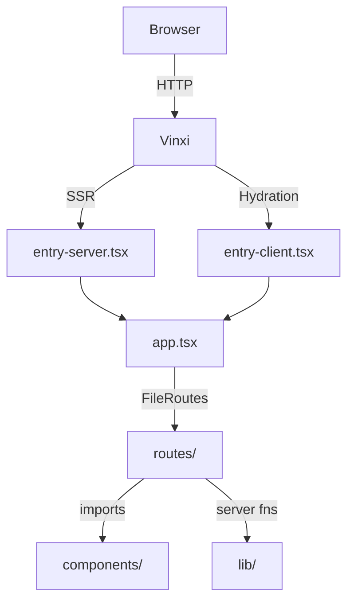

# Architecture

The app is a SolidStart full-stack application. SolidStart provides SSR, file-based routing, and server functions on top of SolidJS's reactive primitives.

## Request Flow



## Key Layers

### `app.tsx` — Root Layout

Wraps every page in a `<Router>` with a shared `<Nav>` and a `<Suspense>` boundary for async data.

### `src/routes/` — Pages

Each `.tsx` file becomes a route. The router maps filenames to URL paths. See [Routing](./routing.md).

### `src/components/` — UI

Reusable SolidJS components. No business logic — they receive data via props and emit events via callbacks. See [Components](./components.md).

### `src/lib/` — Shared Logic

Type definitions, configuration constants, server-side data fetchers, and the document conversion pipeline. See [Server Functions](./server-functions.md) and [Data Pipeline](./data-pipeline.md).

## Build Tooling

**Vinxi** orchestrates the build. It bundles the client and server separately, handles HMR in dev, and produces a Node.js server for production. The Tailwind CSS Vite plugin is registered in `app.config.ts`:

```ts
import { defineConfig } from "@solidjs/start/config";
import tailwindcss from "@tailwindcss/vite";

export default defineConfig({
  vite: {
    plugins: [tailwindcss()]
  }
});
```
