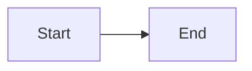

# These are some docs

Currently, this refers to Ryan, since he has all the keys and passwords for all technical things.


## Usage

### Global Variables


This is an example of global variables:

```bash
ping {{google_dns}}
```

These are set in ../book.toml like so:


```toml

[book]
title = "My Docs"
authors = ["Author Name"]
language = "en"

[preprocessor.variables.variables]
google_dns = "8.8.8.8"

```


### Mermaid


